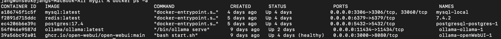
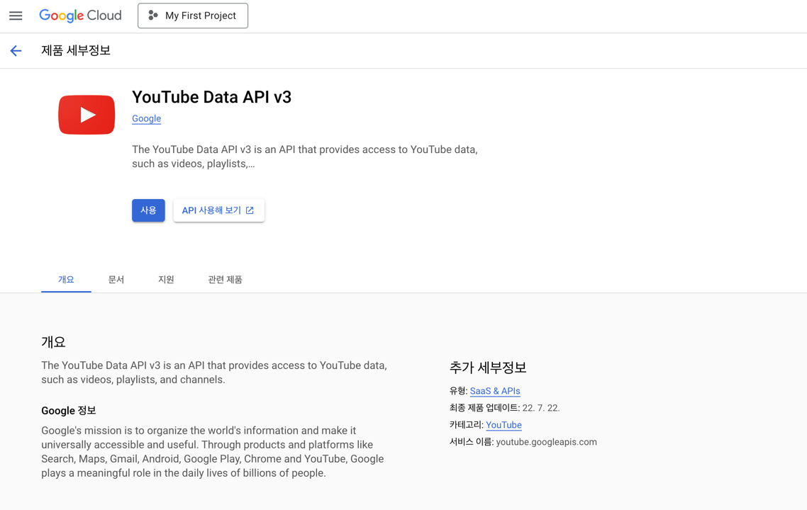
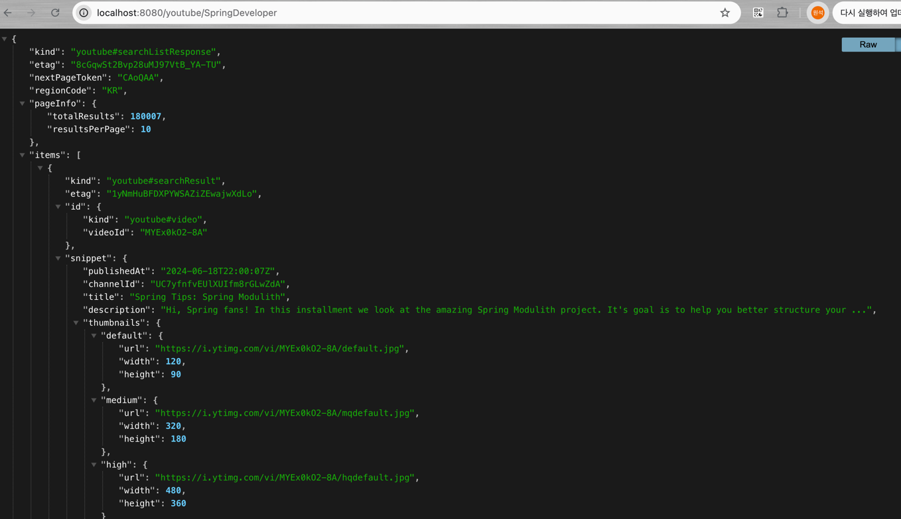

# boot-search-api

google search api
bing search api
duckduckgo search api
naver search api

google
apikey ref = https://developers.google.com/custom-search/v1/overview?hl=ko
cxid ref = https://programmablesearchengine.google.com/controlpanel/all

bing
ref =  https://portal.azure.com/#create/microsoft.bingsearch
pricing = https://www.microsoft.com/en-us/bing/apis/pricing
azure ref = https://portal.azure.com/#home
이건 지금 오류나서 애저 문의중

youtube Data Api v3

ref = https://console.cloud.google.com/

video id를 사용하면됨.
https://www.youtube.com/watch?v={videoId}

