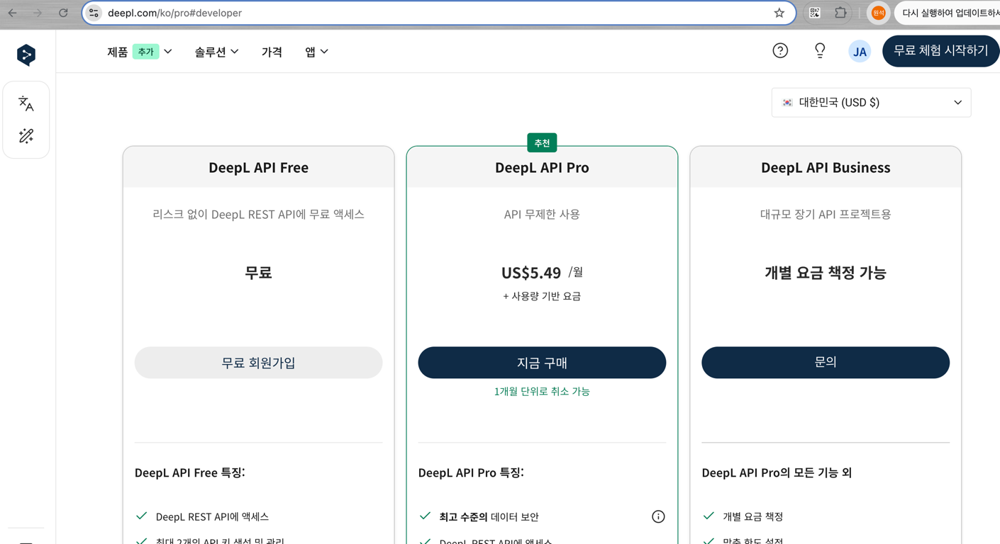

### spring ai exame

로컬 올라마 모델을 이용한
deepseek, EXAONE 2개모델을 운용하는 백엔드 프로젝트

ref= https://docs.spring.io/spring-ai/reference/api/chat/ollama-chat.html

spring git: https://github.com/spring-projects/spring-ai/tree/main/models/spring-ai-ollama


chatgpt
ref = https://platform.openai.com/settings/organization/billing/overview

gemini 
ref = https://aistudio.google.com/apikey

```bash
curl "https://generativelanguage.googleapis.com/v1beta/models/gemini-2.0-flash:generateContent?key=GEMINI_API_KEY" \
-H 'Content-Type: application/json' \
-X POST \
-d '{
  "contents": [{
    "parts":[{"text": "Explain how AI works"}]
    }]
   }'
```


api활성



