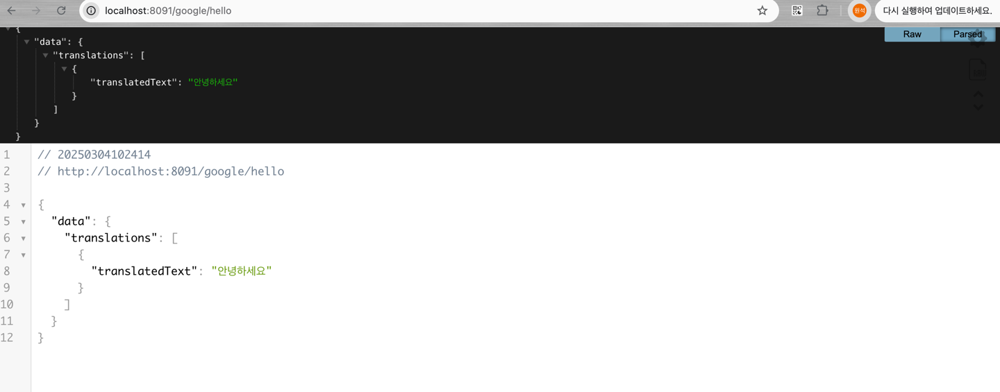
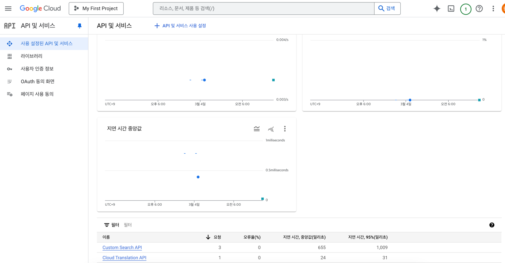
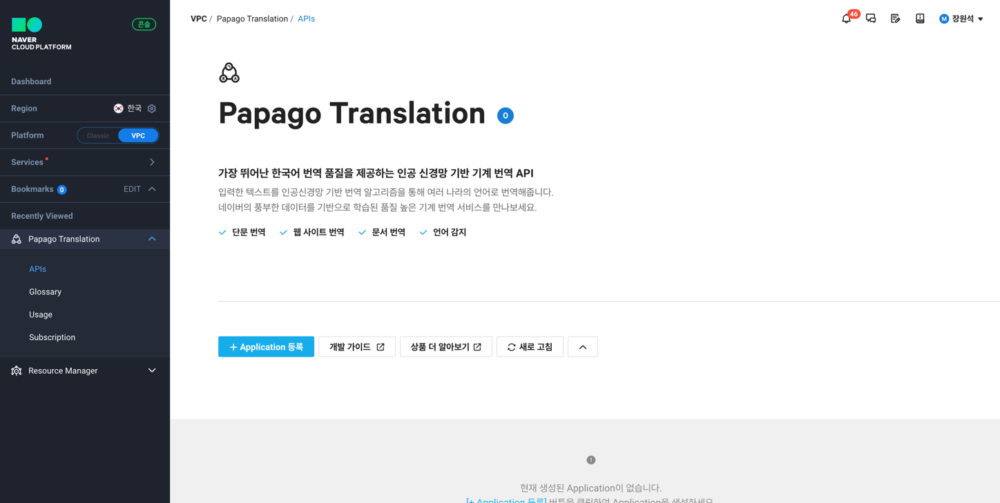
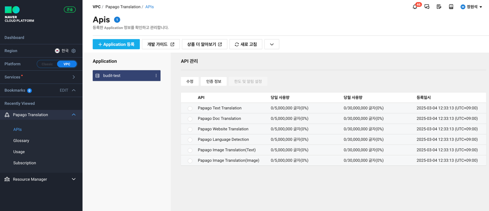
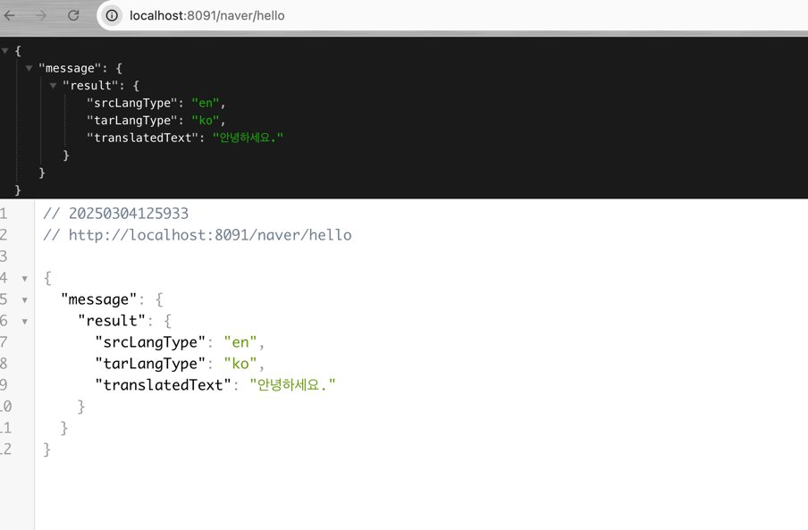

# boot-translate-api
ref = https://console.cloud.google.com/marketplace/product/google/translate.googleapis.com?q=search&referrer=search&inv=1&invt=AbrFWw&project=genuine-axe-310600

Google

사용량

papago Naver Cloud
ref = https://guide.ncloud-docs.com/docs/naveropenapiv3-application

어플리케이션 등록

인증정보에서 아이디 시크릿 확인

Deepl Api
ref = https://www.deepl.com/ko/pro#developer
회원가입후
ref = https://www.deepl.com/ko/pro#developer
무료가입

