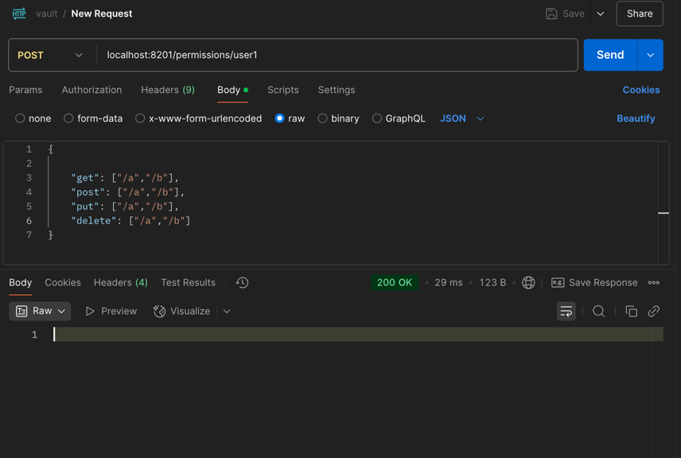
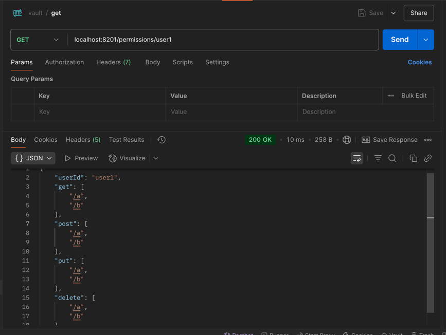

``` bash
docker exec -it vault sh
vault login myroot
vault secrets enable -path=secret kv-v2
vault kv put secret/myapp username=admin password=pass1234

```

``` text
Get "https://127.0.0.1:8200/v1/sys/internal/ui/mounts/secret/myapp": http: server gave HTTP response to HTTPS client
/ # export VAULT_ADDR=http://127.0.0.1:8200
/ # vault login myroot
Success! You are now authenticated. The token information displayed below
is already stored in the token helper. You do NOT need to run "vault login"
again. Future Vault requests will automatically use this token.

Key                  Value
---                  -----
token                myroot
token_accessor       ApRxTFf2pj2HUaSaYnaYOI6b
token_duration       ∞
token_renewable      false
token_policies       ["root"]
identity_policies    []
policies             ["root"]
/ # vault secrets enable -path=secret kv-v2
Error enabling: Error making API request.

URL: POST http://127.0.0.1:8200/v1/sys/mounts/secret
Code: 400. Errors:

* path is already in use at secret/
/ # vault kv put secret/myapp username=admin password=pass1234
== Secret Path ==
secret/data/myapp

======= Metadata =======
Key                Value
---                -----
created_time       2025-08-04T04:50:29.108269554Z
custom_metadata    <nil>
deletion_time      n/a
destroyed          false
version            1

```

쓰기

   
읽기



